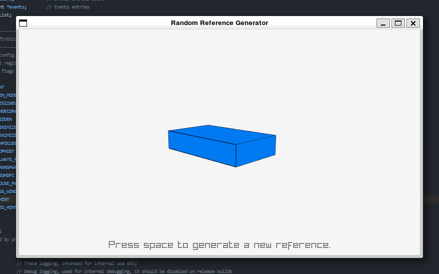

# What is this?
I am learning to sketch and I'm currently practicing primitive 3D objects in one-point perspective. This is a program which generates references of random dimensions, and points the camera at them from a random perspective. Right now it only supports cubes, I may update it as I progress.

